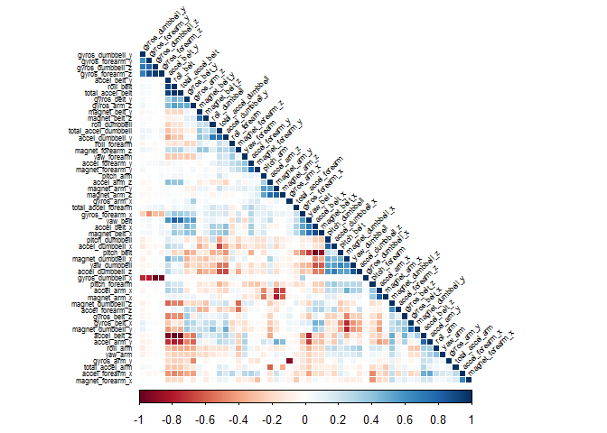
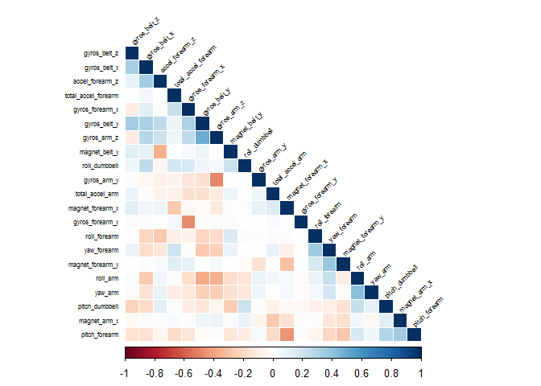

# A personal data-trainer for Weight Lifting
Max Almodovar  
Thursday, March 24, 2016  

Using devices such as *Jawbone Up*, *Nike FuelBand*, and *Fitbit* it is now possible to collect a large amount of data about personal activity relatively inexpensively. These type of devices are part of the quantified self movement - a group of enthusiasts who take measurements about themselves regularly to improve their health, to find patterns in their behavior, or because they are tech geeks. One thing that people regularly do is quantify how much of a particular activity they do, but they rarely quantify how well they do it. In this project, your goal will be to use data from accelerometers on the belt, forearm, arm, and dumbell of 6 participants. They were asked to perform barbell lifts correctly and incorrectly in 5 different ways. More information is available from the website here: <http://groupware.les.inf.puc-rio.br/har> (see the section on the Weight Lifting Exercise Dataset).

For this project, we will use the following libraries:


```r
library(ggplot2)
library(caret)
library(rattle)
library(corrplot)
library(rpart)
```

## Section 1: Data Ingestion

The training data for this project are available here: <https://d396qusza40orc.cloudfront.net/predmachlearn/pml-training.csv>

The test data are available here:<https://d396qusza40orc.cloudfront.net/predmachlearn/pml-testing.csv>

First, we need to load the datasets in our system.


```r
train <- read.csv(train_file)
test <- read.csv(test_file)
```

## Section 2: Cleaning the Data 
The objective of this paper is to predict the variable `classe` in the test dataset. In order to do so, we are going to use the train dataset that contains 19622 observations of 160 variables. First of all, we are going to filter several variables containing null data using a function (see details on this filtering in the `bin/ingestion.R` file). 


```r
train <- filterVariables(train)
test <- filterVariables(test)
```
By filtering the null data we have ended up with only 53 variables that will be used for our prediction model.

## Section 3: Creating the Training and Testing Data
The test dataset that we loaded cannot be used for testing since it does not include information about the `classe` variables. Hence, we need to create a training and a testing datasets using the current train dataset. We have decided to create a 60/40 partition following the pattern shown in the course. 


```r
set.seed(12345)
inTrain <- createDataPartition(y = train$classe,
                               p = 0.6, list = FALSE)
myTraining <- train[inTrain, ]
myTesting <- train[-inTrain, ]
```

## Section 4: Selection of variables
As we mentioned before, we have 53 variables that we can use to predict. Let's use a correlation matrix to decide which variables we should use.


```r
corMat <- cor(myTraining[,-dim(myTraining)[2]],)
corrplot(corMat, method = "color", type="lower", order="hclust",
         tl.cex = 0.50, tl.col="black", tl.srt = 45)
```



From the plot, we cleary see that there are several variables highly correlated. We are going to exclude them from our training dataset and let's look at the new correlation matrix.


```r
exclude <- findCorrelation(corMat, cutoff = 0.5)
myNewTraining <- myTraining[,-exclude]

corMat <- cor(myNewTraining[,-dim(myNewTraining)[2]],)
corrplot(corMat, method = "color", type="lower", order="hclust",
         tl.cex = 0.50, tl.col="black", tl.srt = 45)
```



We'll use 22 variables in our model, since they are very independent from each other.

## Section 5: Training & Validating the model
Since we are predicting a discrete variable with continuous variables, we have decided to use a random forest. Initially, a classification tree was considered but it was to unaccurate (a redcution of more than 20% in accuracy) compared to a random forest. 


```r
modFit <- train(classe ~ ., method = "rf", data = myNewTraining)
```

Now that we have our model, let's try to predict the `classe` variable on the testing dataset.


```r
predictions <- predict(modFit, newdata = myTesting)
confMat <- confusionMatrix(predictions, myTesting$classe)
confMat$table
```

```
##           Reference
## Prediction    A    B    C    D    E
##          A 2214   18    3    3    1
##          B   12 1485   19    5    0
##          C    1    9 1338   43    2
##          D    4    4    8 1231    8
##          E    1    2    0    4 1431
```

From the table, we can see that the model is quite accurate. But let's quantify it.


```r
accuracy <- sum((predictions == myTesting$classe))/dim(myTesting)[1]
oos_error <- 1 - accuracy
```

Our model is 98.1264339% accurate and has an error of approximately 1.8735661%

## Section 6: Prediction Results
Now, let's use the original test data set in order to predict the unknow variables of the `classe`


```r
predictions <- predict(modFit, newdata = test)
predictions
```

```
##  [1] B A B A A E D B A A B C B A E E A B B B
## Levels: A B C D E
```

